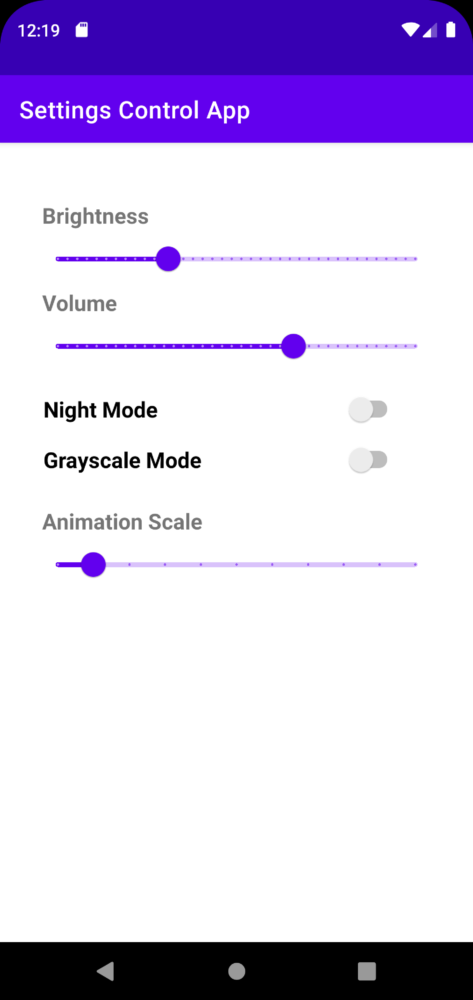

# Settings Control App

## About

Settings Control App enables you to change system settings, from brightness to animation scales. For now, system write permission is needed to change brightness or volume; changes to night model are effective on Android API 23 through API 28 [[reference](https://developer.android.com/reference/android/app/UiModeManager#setNightMode(int))]; and root access and the permission to write secure settings are required to switch to grayscale mode or change animation scale.

The Animation Scale changes both window animation scale and transition animation scale. Grayscale Mode and Animation Scale can be found in your Android's developer settings.

See the [demo video](https://drive.google.com/file/d/1f-tsAwTrNCihAqUzW49MmY9dXI5YzIVE/view?usp=sharing).

## Getting Started

- [Android Studio](https://developer.android.com/studio) is the IDE used in this project to code and launch emulators.
- Create a device in Android Studio. To use possibly all functions, choose a system image without Google Play and API Level from 23 to 28. Build and run!
- To have access to Grayscale Mode and Animation Scale, we need root access and extra permissions. Follow [this](https://stackoverflow.com/a/59284223).

## Acknowledgement

- [Material Design](https://material.io/components/sliders)
- [Anhong Guo](https://guoanhong.com/)
